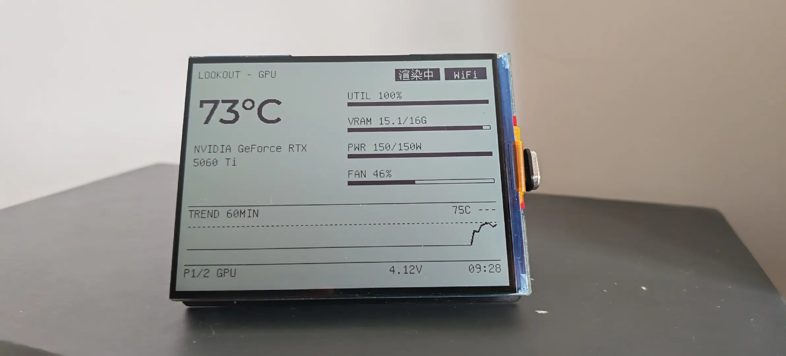

# gpu-watchtower · 显卡瞭望塔

一块 4.2 寸反射式墨水屏桌搭，**实时盯着你的 GPU**：温度大字一瞥、利用率/显存/功耗/风扇全量、60 分钟温度曲线、超温整屏警报。为长夜渲片无人值守而生。



*实拍：渲片满载工况——GPU 71°C、利用率 100%、显存 15.5/16G、功率 170W，「渲染中」标签点亮，底部 60 分钟温度爬升曲线清晰可见。*

## 它盯着 GPU 的哪些事

| 能力 | 说明 |
|---|---|
| **温度一瞥层** | 超大字号 GPU 温度常驻左半屏，≥80°C 加重反白，看一眼就知道显卡热不热 |
| **全量指标** | 利用率 / 显存 / 功耗（含上限）/ 风扇转速，四组数值 + 进度条 |
| **60 分钟温度曲线** | 服务端记录 12h@10s 历史，屏幕显示近 60 分钟切片；**板子重启曲线不清零**，开机即满图 |
| **「渲染中」状态牌** | GPU 利用率 ≥15% 自动点亮，空载隐身——扫一眼标题就知道机器在不在干活 |
| **超温警报** | GPU/CPU ≥85°C 持续 30s（迟滞防抖）→ **整屏反白警报牌**，夜班渲片的温度哨兵 |
| **离线可分辨** | 服务器失联不换页：数据沿用最后快照 + 底栏「离线」小标；顶栏 WiFi 标提醒服务器侧仍走无线（那台机器的网卡有满载挂死前科，值得盯） |

## 省电与自主性（哨兵节拍）

显卡温度是双态分布（空载 ~30°C / 满载 ~70°C），实时性要求天然不高：

- **双档轮询**：空闲 10 秒一拍，渲片/升温自动切 2 秒快档，渲完回落（迟滞防抖）
- **曲线记忆外包给服务器**：板子零状态，唤醒时增量回补缺失数据
- **CPU 睡眠**：tickless + DFS 动态调频，事件驱动主循环（按键中断唤醒）
- **WiFi 射频降档**：空闲 5 分钟自动 MAX_MODEM，任何活动即刻恢复
- **低压深睡**：电池 <3.65V → 清屏只显「休眠中」→ 深睡，1 小时定时或按键唤醒复查
- **无 Mac 依赖**：数据链路 = 板子 ↔ WiFi ↔ 被监控主机，直连无桥

## 四层日志（板子的工作过程全可回看）

```
events.jsonl   状态转换史（boot/cad 升降档/ps 降档/ls/lowbatt/deep_sleep/offline/online...）
board.jsonl    每 10 秒快照（电池电压/节拍档/WiFi RSSI，轮询间隔本身就是节拍证据）
USB 控制台     插线即看：启动序列/PM 状态/心跳/崩溃栈
```

板内 48 槽事件环形缓冲暂存，轮询时批量上传到被监控主机落盘；深睡原因经 RTC 记忆跨睡眠传递、下次开机补报。

## 硬件与架构

- 屏：[Waveshare ESP32-S3-RLCD-4.2](https://www.waveshare.com/wiki/ESP32-S3-RLCD-4.2)（ESP32-S3 N16R8 + 4.2" 400×300 反射式 LCD，ST7305，无背光静态近零耗电）
- 固件：ESP-IDF v5.5.5 + LVGL 9.3.0，Mac/设备双端同源 UI + 像素级 golden 回归
- 被监控侧：任意 Linux 主机跑一个 ~200 行的 Python 导出器（`nvidia-smi` + `psutil`，systemd 常驻）

```
Linux 主机 (被监控)                     ESP32-S3-RLCD (桌搭屏)
┌────────────────────┐    局域网 WiFi    ┌────────────────────┐
│ rig-stats 导出器    │ ◀──2s/10s 轮询──▶ │ 固件：解析 → 渲染   │
│ :7779  token 鉴权   │    POST 事件日志   │ ST7305 局部竖条刷新 │
│ 1s 采样 + 12h 历史  │   （暂存→批量补报）│ 哨兵节拍状态机      │
└────────────────────┘                  └────────────────────┘
```

## 快速开始

1. **被监控主机**（需要 NVIDIA 驱动 + Python3）：

```bash
scp exporter/server.py exporter/rig-stats.service exporter/deploy.sh cui@<主机>:/tmp/
scp exporter/rig-stats.extra-env cui@<主机>:/tmp/   # 按需改挂载点/传感器
ssh cui@<主机> 'echo <sudo密码> | sudo -S bash /tmp/deploy.sh'
```

2. **固件**（需要 ESP-IDF v5.5.5；先拉齐不入库的依赖）：

```bash
./tools/fetch_vendor.sh    # vendor/lvgl @ c033a98（构建依赖，不入库）
cp firmware/main/rig_net_config.h.template firmware/main/rig_net_config.h
# 填入 WiFi SSID/密码、主机 IP、导出器 token（该文件已 gitignore）
idf.py -C firmware -B firmware/build build
idf.py -C firmware -B firmware/build -p <串口> flash
```

3. 模拟器（无需硬件预览 UI）：`cmake -S simulator -B build/simulator && cmake --build build/simulator`

## 项目结构

```
firmware/      ESP-IDF 固件（双页 UI/哨兵节拍/事件日志/低压深睡/PM 睡眠）
shared/        固件与模拟器双端同源代码（UI/JSON 解析/显示帧）
simulator/     SDL 模拟器（--state/--page/--batt/--busy 等 UI 预览）
exporter/      被监控主机侧导出器（/stats /health /history /beacon + systemd）
golden/        14 帧 UI 像素基线（tools/golden_run.sh 回归，永不自动覆盖）
protocol/      数据协议 fixtures（字段全可 null，缺项显 -- 不崩）
tools/         回归/字体导出/节拍哨兵等工具
```

## 致谢

- 硬件时序参照 [Waveshare 官方例程](https://github.com/waveshareteam/ESP32-S3-RLCD-4.2)，UI 工程纪律承自同作者的 [hermes-courier](https://github.com/jlcbk/hermes-courier) 与 codex-desk-terminal 两个姊妹屏项目
- [LVGL](https://github.com/lvgl/lvgl) 9.3.0（双端锁定）

## License

[MIT](LICENSE)
